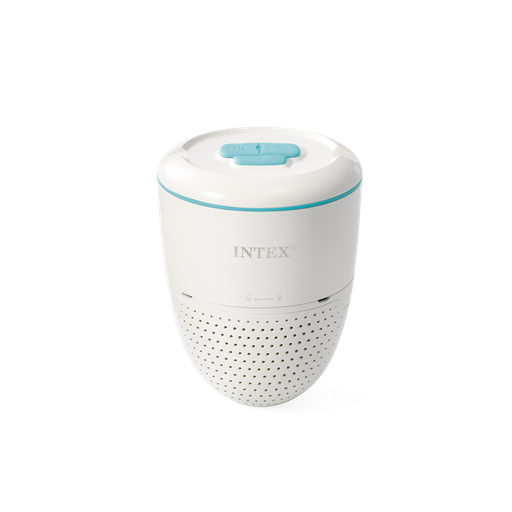

# Intex WA510 Water Analyzer v0.5.1

Home Assistant custom integration for the Intex WA510 / AGP SMART SENSOR T3U via Tuya Cloud.

## v0.5.1

Corrections:
- removed duplicate unavailable sensor entities for pH/ORP setpoints and maintenance thresholds
- clearer labels for calibration and maintenance items
- translated Tuya `off` indicator status to `Normal` / `Aucune`
- cleaner Configuration and Diagnostic sections

Features:
- pH, ORP, temperature, battery, free chlorine, corrected free chlorine
- refresh measurement button with delayed Home Assistant refresh
- pH and ORP setpoints
- configurable maintenance thresholds
- last real measurement timestamp
- built-in cleaning and calibration tracking

Calibration command buttons are experimental. Do not use them outside a real calibration procedure.
